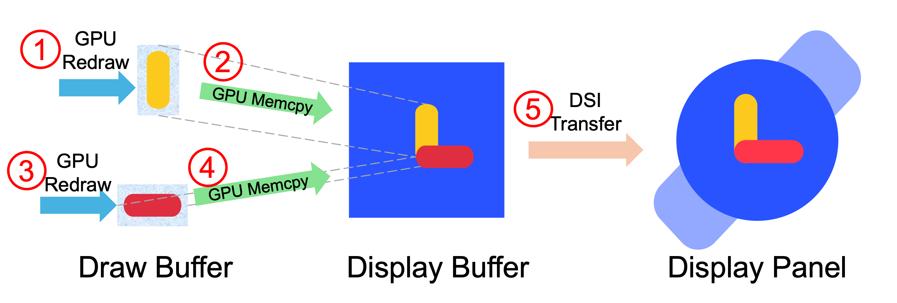
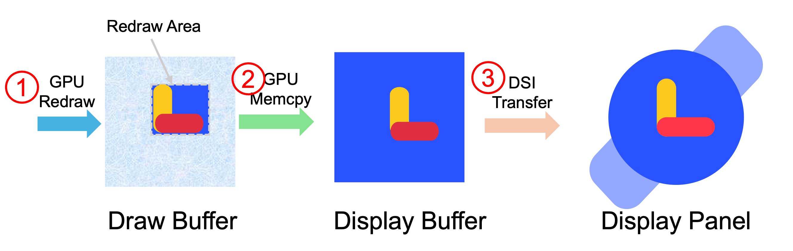
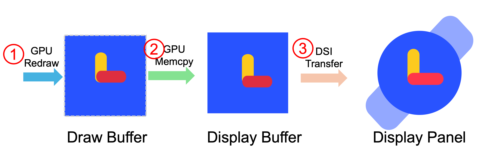

# LVGL Integration Guide for Ambiq Apollo Platform

This document provides detailed instructions for integrating LVGL (Light and Versatile Graphics Library) on the Ambiq Apollo series SoCs. It covers three main areas:

1. Display Refresh
2. Touch Input Handling
3. File I/O

---

## 1. Display Refresh

LVGL supports three display refresh modes:

* **Partial Refresh (LV_DISP_RENDER_MODE_PARTIAL)**: Uses smaller draw buffers (>= 1/10 screen size) to render and flush only updated regions. The `flush_cb` callback copies the changed area from the draw buffer to the display, so, for example, only a pressed button’s region is redrawn.
* **Direct Mode (LV_DISP_RENDER_MODE_DIRECT)**: Requires full-screen-sized buffer(s). LVGL renders pixels directly into their final buffer locations. In this mode, only the regions that have changed—such as a pressed button—are redrawn.
* **Full Refresh (LV_DISP_RENDER_MODE_FULL)**: Also uses full-screen buffer(s). The entire screen is redrawn each cycle, regardless of changes.

> For more technical details on these modes, please refer to the official LVGL documentation: https://docs.lvgl.io

In this repository, we provide complete support for all three LVGL display refresh modes in the file `lv_ambiq_display.c`.

On the Ambiq Apollo platform, we strongly recommend allocating a **display buffer** equal in size to the panel resolution for all refresh modes. This approach effectively prevents **screen tearing** during updates. (See: [https://en.wikipedia.org/wiki/Screen\_tearing](https://en.wikipedia.org/wiki/Screen_tearing))

### 1.1 Partial Refresh Mode Workflow

Figure 1 illustrates the partial refresh process:

The following steps illustrate how partial refresh is implemented in our driver:

The following steps illustrate how partial refresh is implemented in our driver:

1. **Rendering Phase**

   * The GPU renders graphics into the **draw buffer**.
   * Once a region is complete, LVGL triggers the `display_flush_cb` callback.

2. **Memcopy to Display Buffer**

   * Inside `display_flush_cb`, the GPU performs a `memcpy` from the draw buffer to the **display buffer**, targeting the region specified by `redraw_area`.

3. **Prepare Next Region**

   * LVGL reshapes or clears the draw buffer and then re-renders (redraws) the next region.

4. **Second Flush** **Second Flush**

   * GPU performs another `memcpy` to copy the newly drawn region into a different area of the display buffer.

5. **Trigger DSI Transfer**

   * When `lv_display_flush_is_last()` returns true, the driver calls `am_devices_display_transfer_frame()`.
   * This function initiates an asynchronous DSI bus transfer to the panel, potentially synchronized via the TE (Tearing Effect) signal.
   * Upon transfer completion, `transfer_complete_cb` is invoked and signals a semaphore to coordinate buffer writes (steps 2 & 4) and reads (step 5).

This mechanism ensures conflict-free access to the display buffer, smooth frame updates, and consistent visuals.

In this process, the display buffer plays a crucial role: without a dedicated display buffer, the driver would need to reissue DSI commands to set the screen update region after rendering steps 1 and 3. This reconfiguration is time-consuming, and if updating different regions of the same frame exceeds the panel’s update timing, screen tearing can occur. Therefore, we strongly recommend that customers allocate a full-screen display buffer when using partial refresh mode.

### 1.2 Direct and Full Refresh Modes

Figures 2 and 3 illustrate the workflows for Direct Mode and Full Refresh Mode, respectively:

**Direct Mode (LV_DISP_RENDER_MODE_DIRECT)**
The refresh workflow mirrors the Partial Refresh process, but without limiting the redraw region by draw buffer size. This allows the GPU to redraw the updated regions (e.g., a pressed button) with higher efficiency compared to Partial Refresh. After rendering, `display_flush_cb` triggers a `memcpy` of those regions into the full-screen display buffer, followed by an asynchronous DSI transfer.

**Full Refresh (LV_DISP_RENDER_MODE_FULL)**
In this mode, the entire screen is rendered first. Only when the full frame is complete does `display_flush_cb` perform a single GPU_Memcpy of the complete buffer and initiate the DSI transfer.

In both modes, allocating a **full-screen display buffer** significantly accelerates overall system performance. With a display buffer in place, the GPU and DC/DSI engine can operate in parallel: while the DSI bus is transmitting the previous frame, the GPU can immediately begin rendering the next one. Without a display buffer, the GPU must wait for the DSI transfer to finish before starting on the next frame, resulting in a sequential pipeline that limits throughput.

On typical hardware, a full-screen DSI transfer takes on the order of **10 ms**. Therefore, achieving a target frame rate of **60 FPS** effectively **requires** a full-screen display buffer to avoid frame drops and tearing.

### 1.3 Recommended Refresh Mode

Our implementation in `lv_ambiq_display.c` fully addresses display refresh challenges and maximizes hardware performance across all three modes. Customers can select the optimal mode based on memory budget and target frame rate:

- **Direct Mode** offers the highest frame rate and hardware efficiency by allowing GPU rendering and DSI transfers to overlap. However, it requires two full-screen draw buffers, which may be memory-intensive.
- **Partial Refresh** is suitable for memory-constrained systems. It uses smaller buffers and minimizes RAM usage, but if the draw buffer is set too small (e.g., less than 1/4 of full-screen size), performance may degrade in full-screen update scenarios, such as complex animations.
- **Full Refresh** is generally **not recommended** for most applications, as it forces the GPU to redraw the entire frame every cycle. This additional workload can negatively impact power consumption and achievable frame rate.

By understanding the trade-offs, developers can choose the mode that best balances memory usage, power efficiency, and rendering performance for their specific application.

---

## 2. Touch Input Handling

> *Section under development: Describe how to initialize the AmbiqSuite touchscreen driver and register LVGL input device callbacks.*

---

## 3. File I/O

> *Section under development: Detail integration of EMMC-based file system support for LVGL file operations.*