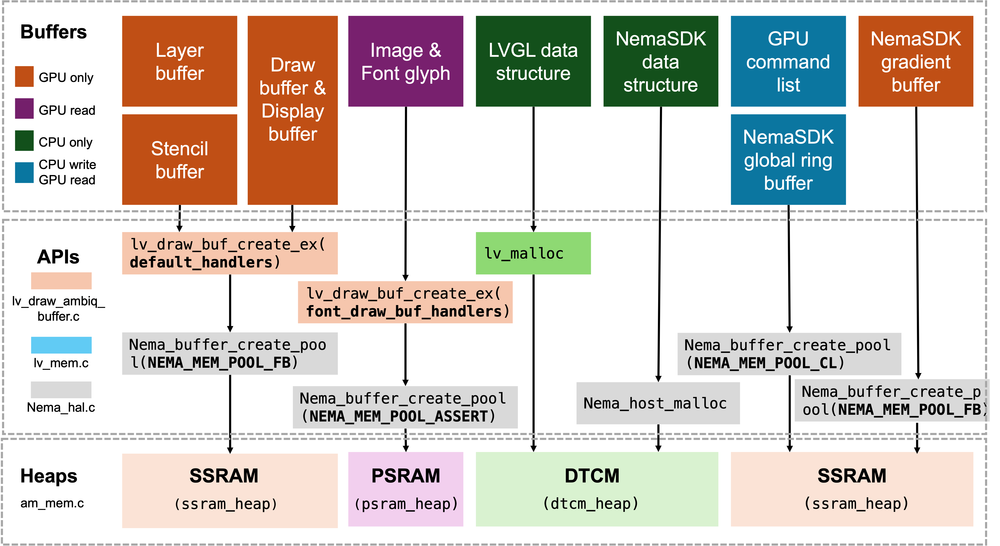

# Memory Heap Management Guide for Ambiq Apollo Platform

This document outlines our recommended memory heap management strategy for LVGL-based applications on the Ambiq Apollo series SoCs. It covers the following sections:

1. **On-Chip RAM Resources**  
   Overview of available RAM regions on the Apollo chip, their characteristics, and suitable data placement.

2. **LVGL Buffers**  
   Description of the internal buffers allocated by LVGL and what types of data they store.

3. **NemaSDK Buffers**  
   Details of GPU driver (NemaSDK) buffer allocations and their usage.

4. **Heap Management Implementation**  
   Explanation of our current memory heap management approach, including heap partitioning and allocation policies.

---

## 1. On-Chip RAM Resources

The Ambiq Apollo series SoCs provide three main RAM regions, each with distinct capacity and performance characteristics:

| **Memory** | **Capacity**               | **Location**                   | **GPU Accessible** |
| ---------- | -------------------------- | ------------------------------ | ------------------ |
| **TCM**    | 378 KB – 496 KB            | On-chip tightly-coupled memory | Yes                |
| **SSRAM**  | 1 MB – 3 MB                | On-chip SRAM                   | Yes                |
| **PSRAM**  | Configurable (64 KB–256 MB) | External (MSPI interface, XIP) | Yes                |

### 1.1 Memory Characteristics & Recommended Usage

- **TCM (Tightly Coupled Memory)**  
  Ultra-low latency, small capacity.  
  **Ideal for:**  
  - CPU stacks & RTOS heap (task stacks, semaphores, queues, events)  
  - Small, CPU-only data structures  

- **SSRAM (Static SRAM)**  
  Moderate capacity and latency, shared between CPU & GPU.  
  **Ideal for:**  
  - Frame buffers  
  - GPU command lists  
  - Shared data buffers used by LVGL and the GPU  

- **PSRAM (Pseudo-SRAM)**  
  Large capacity, higher latency; external memory accessed via MSPI in XIP mode.  
  **Ideal for:**  
  - Image textures  
  - Font bitmaps  
  - Large assets with moderate latency requirements  

---

## 2. LVGL Buffers

LVGL uses two distinct categories of buffers:

1. **CPU-Only Buffers**
   These store LVGL’s internal data structures (task control blocks, style descriptors, widget states, etc.) and are allocated via `lv_malloc` (`lv_mem.h`).
   **Placement Recommendation:**

   - **DTCM** or **cachable SSRAM** for low-latency access.
   - **Avoid PSRAM** to prevent UI stutters caused by high latency.

2. **Shared CPU/GPU Draw Buffers**
   These buffers hold pixel data for images, font glyphs, or the current LVGL layer and must be visible to both the CPU (for drawing commands) and the GPU (for accelerated rendering). They are created with `lv_draw_buf_create_ex` (`lv_draw_buf.h`).

   **Memory Management Strategy:**
   In `lv_draw_ambiq_buffer.c`, we map LVGL’s draw-buffer callbacks to the Nema HAL interfaces (`nema_buffer_create_pool`, `nema_buffer_destroy`, `nema_buffer_flush`/`invalidate`):

   - **Layer (frame) buffers** → allocate from `NEMA_MEM_POOL_FB`
   - **Image & font glyph buffers** → allocate from `NEMA_MEM_POOL_ASSETS`

   **Placement Recommendation:**

   - **Layer buffers (**`**NEMA_MEM_POOL_FB**`**)** should reside in **SSRAM** to maximize GPU rendering efficiency.
   - **Image & font glyph buffers (**`**NEMA_MEM_POOL_ASSETS**`**)** should reside in **PSRAM**, as they typically require large capacity and are mainly read by the GPU.

By separating LVGL’s control-plane data (CPU-only buffers) into the fastest on-chip memory and directing all pixel-plane data through the Nema-managed pools, this model maximizes throughput, minimizes UI latency, and keeps RAM usage predictable.

---

## 3. NemaSDK Buffers

In the NemaSDK, all dynamic allocations are routed through three HAL APIs in `nema_hal.c`:

- **`nema_host_malloc(size_t size)`**  
  Allocates CPU-only structures such as `nema_cmdlist_t`, `nema_vg_paint_t`, `nema_vg_grad_t`, and `nema_vg_path_t`. These objects are managed by the CPU; the GPU never accesses them directly.
- **`nema_buffer_create(size_t size)`**  
  Currently used only within the `nema_blit_hist_equalization()` routine to allocate a 256-byte temporary buffer. If your application does not invoke histogram equalization, this API can be ignored.
- **`nema_buffer_create_pool(int pool, size_t size)`**  
  The primary mechanism for allocating shared buffers visible to the GPU. It returns a `nema_buffer_t` that describes a contiguous memory region from the specified pool. Three common pool usages are:
  1. **Command List (CL) Buffers**  
     - **Pool:** `NEMA_MEM_POOL_CL`  
     - **Purpose:** Holds GPU command lists.  
     - **Placement:** Must reside in **SSRAM** for optimal execution rate—placing these in PSRAM or TCM will considerably slow down command throughput.
     - **APIs**: Calls to `nema_cl_create()` and `nema_cl_create_sized()` internally invoke `nema_buffer_create_pool()` with `NEMA_MEM_POOL_CL`.
  2. **Gradient Buffer**  
     - **Pool:** `NEMA_MEM_POOL_FB`  
     - **Purpose:** Stores complex gradient content  (`size = 256`)  
     - **Placement:** Best placed in **SSRAM** to maximize rendering performance.
     - **APIs:** `nema_vg_grad_create()` triggers allocation of this buffer.
  3. **Stencil Buffer for Vector Graphics**  
     - **Pool:** `NEMA_MEM_POOL_FB`  
     - **Purpose:** Stores the per-pixel stencil mask used by the NemaVG vector graphics engine.  
     - **Placement:** Should reside in **SSRAM** to ensure low-latency access and optimal rendering throughput.  
     - **APIs:**
       - `nema_vg_init()` allocates from `NEMA_MEM_POOL_FB` by default.
       - `nema_vg_init_stencil_pool(pool)` or `nema_vg_init_stencil_prealloc(ptr, size)` use the specified pool or preallocated memory instead.

> **Alignment Requirement:**  
>
> - On Apollo5: All GPU-accessible buffers must be 32-byte aligned to maintain cache coherency and avoid data corruption if data cache is enabled and allocated from a cachable region, otherwise, if cache is not enabled or allocated from a non-cachable region, 8 bytes alignment is enough.  
> - On Apollo4: A minimum alignment of 8 bytes is required for any GPU-shared allocation.

Developers should adapt these HAL stubs (`nema_host_malloc`, `nema_buffer_create`, `nema_buffer_create_pool`) to their own heap management framework, ensuring that each pool is backed by the appropriate RAM region and meets the alignment rules above.

---

## 4. Heap Management Implementation

In our LVGL port for the Ambiq Apollo series, we carefully matched each buffer’s usage characteristics (from Sections 1–3) with the SoC’s on-chip and external RAM resources to achieve an optimal memory management scheme. Figure 4 illustrates the overall architecture across three layers—**Buffers**, **APIs**, and **Heaps**—and serves as a reference best-practice solution.

### Unified Allocation Strategy

Rather than scattering buffer allocation across multiple subsystems, we unified all dynamic heap usage through three low-level entry points:

1. **`lv_malloc_core(size_t size)`**  in `lv_mem.c`
   - Allocates CPU-only objects for **LVGL**
   - In our demo, this maps to the **DTCM heap**, providing the lowest latency region.
2. **`nema_host_malloc(size_t size)`** in `nema_hal.c`
   - Allocates CPU-only objects for **NemaGFX**
   - In our demo, this maps to the **DTCM heap**, providing the lowest latency region.
3. **`nema_buffer_create_pool(int pool, size_t size)`** in `nema_hal.c`
   - Allocates GPU-shared buffers (framebuffers, assets, command lists)
   - The `pool` parameter determines the backing heap:
     - `NEMA_MEM_POOL_FB`, `NEMA_MEM_POOL_CL` → **SSRAM heap**
     - `NEMA_MEM_POOL_ASSETS` → **PSRAM heap**

This approach ensures that:

- **High-bandwidth, low-latency** buffers (frame & stencil) live in SSRAM for peak GPU performance.
- **Large, moderate-latency** assets (images/fonts) reside in PSRAM, preserving on-chip SRAM.

### Customization for Customer Projects

In most cases, the default implementation provided in our demo (am_mem.c) is sufficient, allowing you to easily adjust memory pool sizes and cache settings via macro definitions. However, if your project requires changes to the heap management strategy or needs to integrate with an existing heap, follow the two-step customization process described below:

**Step 1: Customize nema_hal.c**

Modify the nema_hal.c file to customize memory management APIs, such as:

- nema_host_malloc(size_t size)
- nema_buffer_create(size_t size)
- nema_buffer_create_pool(int pool, size_t size)
- nema_buffer_destroy(nema_buffer_t *buf)

Implement these functions according to your system’s heap structure and enforce any necessary alignment requirements.

**Step 2: Configure LVGL CPU-Only Allocator**

Modify the LV_USE_STDLIB_MALLOC configuration in lv_conf.h to customize memory allocation for LVGL’s CPU-only buffers. Detailed instructions for this configuration can be found in lv_conf.h and LVGL’s official documentation.

In our provided demo, LV_USE_STDLIB_MALLOC is defined as LV_STDLIB_CUSTOM. Correspondingly, custom implementations of lv_malloc_core, lv_realloc_core, and lv_free_core are provided in am_mem.c, demonstrating allocation from dtcm_heap. You may refer to these implementations as examples for your own customization.